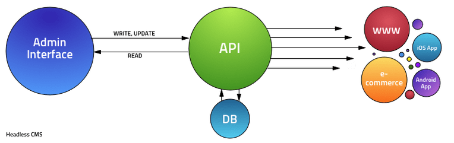
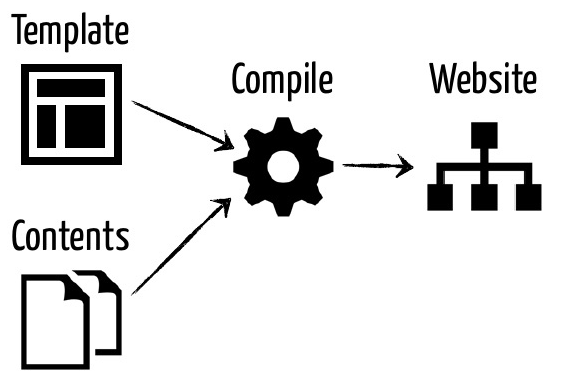

# Strapi + Gatsby

## Qu'est ce qu'un headless CMS

C'est un CMS qui ne s'occupe pas du rendu des pages HTML. Il met seulement à disposition une API et un espace d'administration (CMS)

source : [https://jamstatic.fr/2017/12/15/cms-headless/](https://jamstatic.fr/2017/12/15/cms-headless/)

## Qu'est ce qu'un static site generator

C'est un service qui génére des pages HTML statiques à partir de templates et de sources de données.

[10 static website generators](https://www.netlify.com/blog/2017/05/25/top-ten-static-site-generators-of-2017/)

## Et JAM Stack

JAM Stack est, pour l'expliquer simplement, l'alliance des 2 systèmes : Headless CMS + Static site generator

Explication en détail : [jamstack.org](https://jamstack.org/)

Le stack technique qui suit le mieux les bonnes pratiques de JAMStack est surement NetlifyCMS + Netlify + Gatsby.

Mais nous n'allons pas utiliser Netlify parce que ce n'est pas simplement un CMS. Et ça ferait beaucoup de chose à apprendre alors que notre besoin est limité.